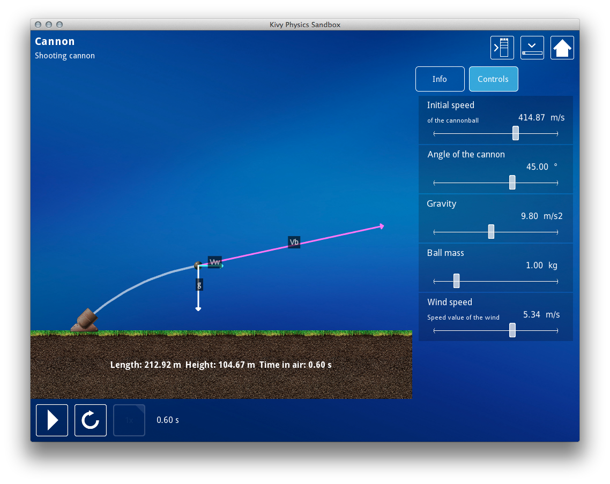
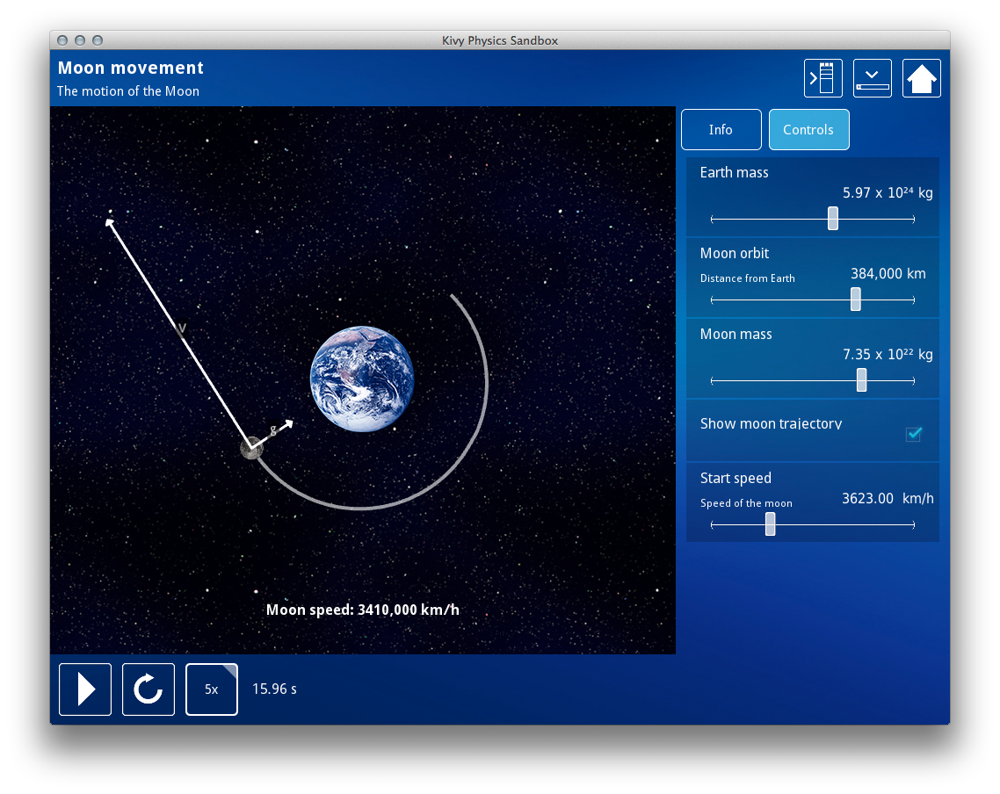
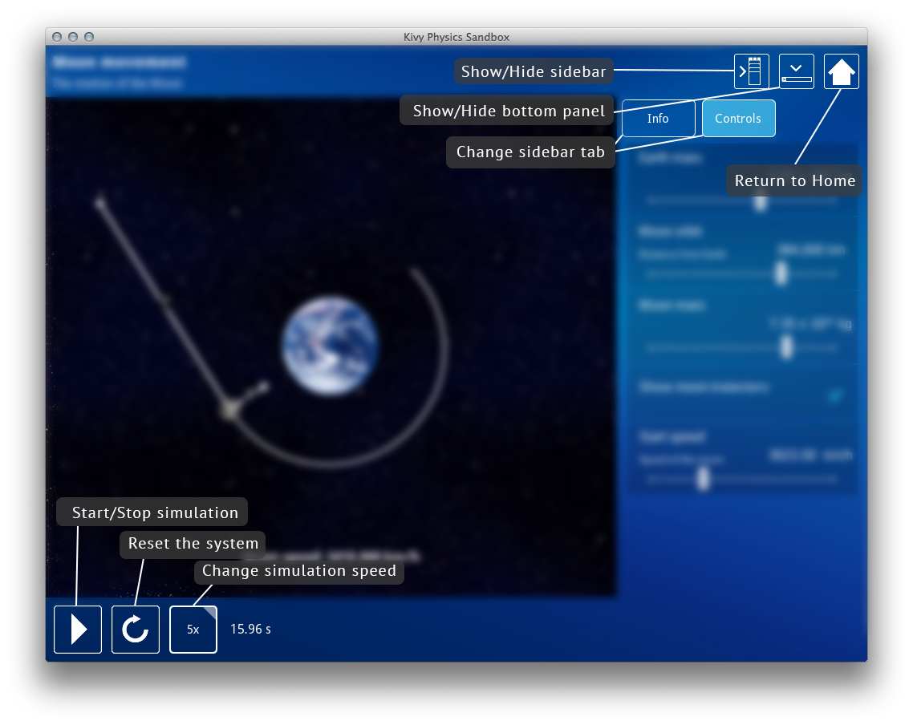

#Kivy Physics Sandbox

Kivy Physics Sandbox is educational application for visualizing different physics-based experiments.

The main feature of this application is interactivity and ability to quickly develop new experiments using application' provided classes.

Works on Windows, Ubuntu, OS X, Android tablet and Android phone (but difficult to use).

##Installation

**Linux**

```bash
git clone https://github.com/Gipzo/kivy-physics-sandbox.git
pip install -r requirements.txt
```

Run application by executing `python main.py`

**Mac OS**

[Mac OS X Release](https://github.com/Gipzo/kivy-physics-sandbox/releases/download/0.1/KivyPhysicsSandbox-osx.dmg)

**Windows**

[Win32 Release](https://github.com/Gipzo/kivy-physics-sandbox/releases/download/0.1/KivyPhysicsSandbox-win32.exe)

**Android**

[Android APK](https://github.com/Gipzo/kivy-physics-sandbox/releases/download/0.1/KivyPhysicsSandbox-android-debug.apk)

##Screenshots






**Controls (with hotkeys)**



##Experiments

Currently there are 4 experiments in 2 categories:

    Kinetics
        Cannon
        Moon movement
        Speed relativity
    Optics
        Refraction

Experiments are dynamically populated from `experiments` folder. Each experiment must have this folder structure:

    experiments/
      __init__.py
      <category>/
        __init__.py
        category.json  # Category information: title and icon file
        <experiment_name>
          __init__.py
          experiment.json  # Experiment information: title, short description and icon file
          description.rst  # Description in RST format
          experiment.py    # Main experiment file
      
`experiment.py` file must have `load_experiment` function that returns class, that must be inherited from `ExperimentWindow` class.

## Classes

[ExperimentWindow](docs/experimentWindow.md "ExperimentWindow") - Main experiment class

**Utility classes**

[PhysicsObject](docs/physicsObject.md "PhysicsObject") - Widget for drawing rotated images and vectors on it

[TexturedWidget](docs/texturedWidget.md "TexturedWidget") - Widget with tiled texture

[LineWidget](docs/lineWidget.md "LineWidget") - Simple line drawing widget


    

